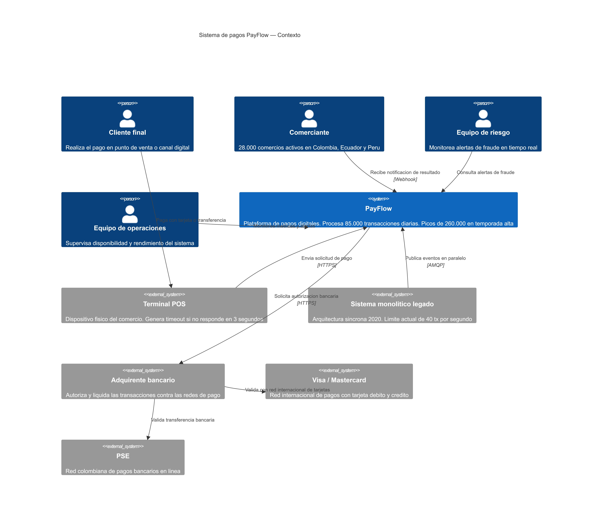
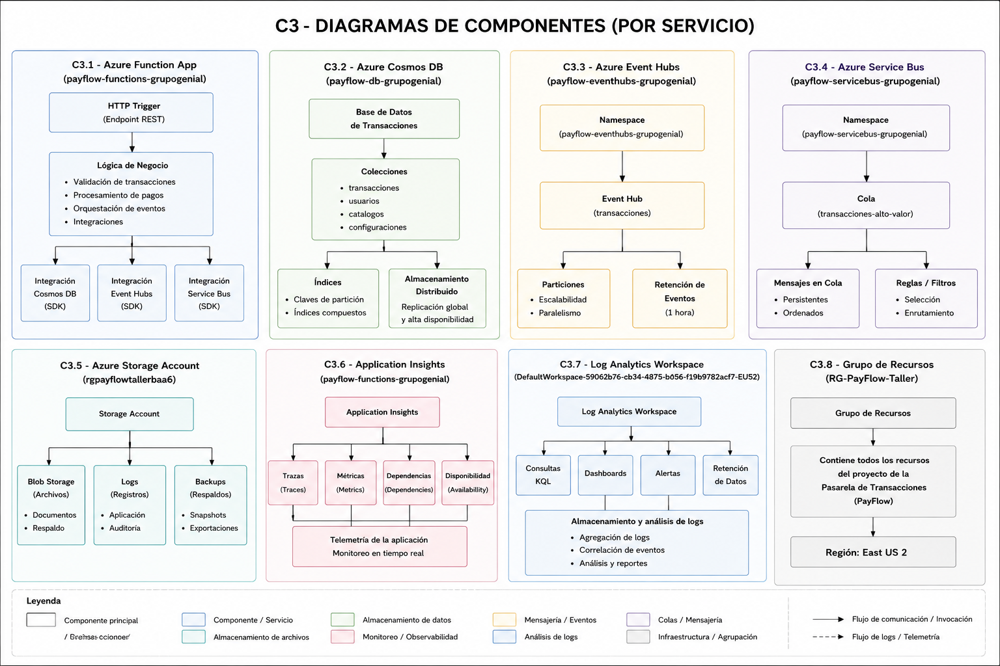
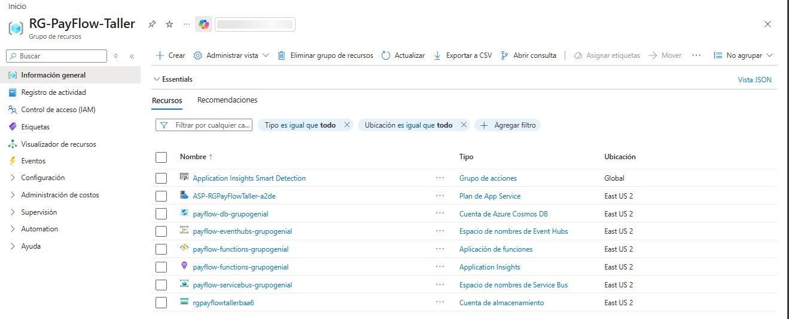
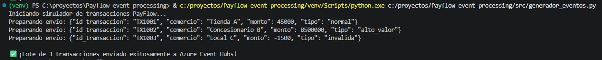
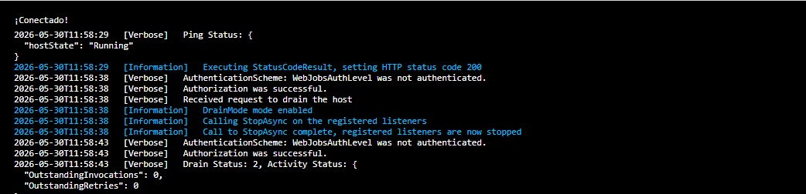
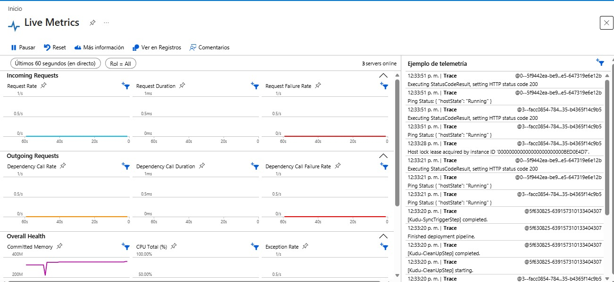

# PayFlow — Procesamiento de Eventos en Tiempo Real

**Curso:** Computación en la Nube | Semestre 2026-1  
**Profesor:** Julián David Florez Sánchez  
**Institución:** Tecnológico de Antioquia — Institución Universitaria  
**Caso:** 03 — Procesamiento de Eventos en Tiempo Real  
**Plataforma:** Microsoft Azure (Free Tier / Azure for Students)  
**Entrega:** 14 de mayo de 2026  

---

## Integrantes

| Nombre |
|--------|
| Daniela Vanegas Guerrero |
| Andrés Felipe Bolívar Osorio |
| Jaison Esteban Córdoba Arroyo |
| Sthyd Anderson Guissao Ramírez |

---

## Descripción del caso

PayFlow es una fintech colombiana fundada en 2020 que ofrece una plataforma de pagos
digitales para pequeños y medianos comercios. Opera como intermediario entre comercios,
adquirentes bancarios y redes de pago (Visa, Mastercard, PSE), procesando transacciones
de compra, reembolsos, pagos de servicios y transferencias entre cuentas.

Actualmente cuenta con 28.000 comercios activos, procesa en promedio 85.000 transacciones
diarias y tiene presencia en Colombia, Ecuador y Perú. En temporada alta el volumen puede
triplicarse, alcanzando hasta 260.000 transacciones en un solo día.

### Problemas identificados en el sistema actual

| Problema | Descripción |
|----------|-------------|
| Cuello de botella | El procesador actual maneja hasta 40 tx/seg. En picos supera los 8 segundos de respuesta |
| Sin priorización | Una transacción de $500 COP y una de $50.000.000 COP pasan por el mismo proceso |
| Fraude reactivo | El antifraude se aplica después de autorizar. El dinero ya está comprometido |
| Sin observabilidad | El equipo se entera de problemas por quejas en WhatsApp, no por alertas automáticas |
| Acoplamiento fuerte | Si el webhook falla, la transacción completa se revierte aunque la autorización fue exitosa |

---

## Arquitectura de referencia

Este caso está basado en la arquitectura oficial de Microsoft Azure para sistemas
de procesamiento de eventos en tiempo real.

- [Event-driven architecture](https://learn.microsoft.com/es-es/azure/architecture/guide/architecture-styles/event-driven)
- [Azure Event Hubs](https://learn.microsoft.com/es-es/azure/event-hubs/event-hubs-about)
- [Azure Functions — trigger por Event Hubs](https://learn.microsoft.com/es-es/azure/azure-functions/functions-bindings-event-hubs)
- [Azure Service Bus](https://learn.microsoft.com/es-es/azure/service-bus-messaging/service-bus-messaging-overview)
- [Azure Cosmos DB](https://learn.microsoft.com/es-es/azure/cosmos-db/introduction)
- [Azure Monitor](https://learn.microsoft.com/es-es/azure/azure-monitor/overview)

---

## Stack de servicios Azure

| Servicio | Responsabilidad en PayFlow | Tier |
|----------|---------------------------|------|
| Azure Event Hubs | Punto de entrada. Buffer distribuido ante picos de demanda. Recibe hasta 500 tx/seg | Basic — 1 TU |
| Azure Functions | Valida, evalúa fraude, enruta por monto y registra cada transacción | Consumption Plan |
| Azure Service Bus | Cola de prioridad para transacciones mayores a $5M COP con reintentos automáticos | Basic tier |
| Cosmos DB | Persiste el estado final de cada transacción procesada | Free tier — 25 GB |
| Azure Monitor + App Insights | Alertas automáticas en menos de 30 segundos. Trazas distribuidas por transacción | Gratuito 5 GB/mes |

---

## Modelo C4

### C1 — Contexto del sistema

PayFlow actúa como sistema central de procesamiento de pagos digitales. Recibe eventos
desde los terminales POS y el sistema legado, solicita autorización al adquirente bancario
y notifica el resultado al comercio mediante webhook. El equipo de riesgo monitorea alertas
de fraude y el equipo de operaciones supervisa la disponibilidad del sistema.

### C2 — Contenedores

El sistema está compuesto por cinco servicios Azure. *(Nota de despliegue: Por restricciones de cuota en la suscripción "Azure for Students", los recursos de este prototipo se desplegaron en `East US 2` como medida de contingencia, documentada para garantizar el aprovisionamiento de las capas gratuitas, aunque en producción se exigiría `Brazil South` por regulación de la Superintendencia Financiera)*. Los eventos fluyen desde Event Hubs hacia Azure Functions, que orquesta la validación, el antifraude, el enrutamiento por monto y el registro en Cosmos DB. Las transacciones mayores a $5M COP se enrutan por un canal diferenciado en Service Bus con garantía de entrega at-least-once.

### C3 — Componentes

El nivel C3 descompone cada servicio Azure utilizado en la solución PayFlow y muestra
sus componentes internos, responsabilidades e interacciones principales.

#### Azure Function App
Contiene la lógica de negocio encargada de validar transacciones, procesar pagos,
aplicar reglas de enrutamiento y coordinar la comunicación con los demás servicios
de la plataforma mediante integraciones con Cosmos DB, Event Hubs y Service Bus.

#### Azure Cosmos DB
Almacena el estado de las transacciones procesadas y la información operativa del
sistema utilizando un modelo de documentos distribuido y altamente escalable.

#### Azure Event Hubs
Actúa como el canal principal de ingesta de eventos en tiempo real, permitiendo
absorber picos de carga y distribuir el procesamiento mediante particiones.

#### Azure Service Bus
Implementa una cola dedicada para transacciones de alto valor, proporcionando
entrega confiable, desacoplamiento entre componentes y capacidad de reintento.

#### Azure Storage Account
Centraliza el almacenamiento de archivos, registros operativos y copias de respaldo
utilizadas por la solución.

#### Application Insights y Log Analytics
Proporcionan observabilidad integral mediante telemetría, métricas, trazas,
consultas de diagnóstico y alertas operativas.

#### Grupo de Recursos
Agrupa todos los servicios desplegados en Azure dentro del proyecto PayFlow,
facilitando la administración y el control de recursos.

---

## Decisiones Arquitectónicas (ADRs)

### ADR-01: Uso de Azure Event Hubs como punto de entrada sobre Azure Service Bus para ingesta de transacciones
*(Ver detalle en historial de commits)*

### ADR-02: Uso de Azure Service Bus para enrutamiento prioritario de transacciones de alto valor
*(Ver detalle en historial de commits)*

### ADR-03: Uso de Azure Functions con Consumption Plan sobre Azure Container Apps para el procesamiento
*(Ver detalle en historial de commits)*

### ADR-04: Uso de Cosmos DB sobre Azure SQL Database para la persistencia de transacciones
*(Ver detalle en historial de commits)*

### ADR-05: Uso de Azure Monitor + Application Insights sobre solución de monitoreo externa para observabilidad
*(Ver detalle en historial de commits)*

---

## Implementación

El desarrollo del prototipo se dividió en tres fases principales para garantizar la separación de responsabilidades y la correcta aplicación del diagrama C3:

### 1. Aprovisionamiento y Configuración
Se creó el grupo de recursos `RG-PayFlow-Taller` centralizando la infraestructura. Para solventar limitaciones de cuota en *Azure for Students* que bloqueaban la región `Brazil South`, se aplicó el plan de contingencia aprovisionando los servicios críticos (Cosmos DB Free Tier de 1000 RU/s y Function App en Consumption Plan) en la región `East US 2`. Para garantizar la seguridad del código, ninguna credencial fue "quemada" (hardcodeada) en el repositorio; todas las cadenas de conexión se configuraron mediante **Variables de Entorno** (App Settings) en la Azure Function.

### 2. Ingesta de Datos (El Simulador)
Se desarrolló un script en Python (`/src/generador_eventos.py`) haciendo uso del SDK `azure-eventhub`. Este simulador inyecta lotes de transacciones hacia Event Hubs, cumpliendo la regla de probar escenarios reales:
* Transacciones de bajo monto (Flujo normal).
* Transacciones con monto negativo (Prueba de reglas antifraude).
* Transacciones que superan los $5.000.000 COP (Prueba de enrutamiento a Service Bus).

### 3. Lógica de Procesamiento (Azure Functions)
La Function App se desarrolló en Python (v3.10+) bajo un modelo modular que refleja el diagrama de componentes (C3):
* `validar_transaccion.py`: Evalúa inconsistencias matemáticas o reglas de negocio (fraude reactivo mitigado).
* `enrutar_por_monto.py`: Clasifica la prioridad del mensaje y deriva a Service Bus si supera los $5M COP.
* `registrar_resultado.py`: Implementa el SDK de Cosmos DB para la creación automática de la base de datos `PayFlowDB` y la colección `Transacciones`, persistiendo el estado final.
* `function_app.py`: El orquestador principal desencadenado por el `event_hub_message_trigger`.

---

## Evidencias

A continuación, se presentan las pruebas de funcionamiento de la arquitectura desplegada en tiempo real:

**1. Stack de Infraestructura**

**2. Ingesta de Eventos**

**3. Procesamiento en Tiempo Real (Azure Functions)**

**6. Observabilidad (Application Insights)**

---

## Conclusiones

La implementación de esta arquitectura orientada a eventos resolvió satisfactoriamente los 5 problemas críticos del sistema legado de PayFlow:

1. **Mitigación del Cuello de Botella:** La adopción de Azure Event Hubs permitió crear un buffer elástico que absorbe eficientemente los picos de demanda, desacoplando la velocidad de entrada (POS) de la velocidad de procesamiento.
2. **Priorización Efectiva:** El uso combinado de Azure Functions para validación condicional y Service Bus garantiza que las transacciones de alto valor (> $5M COP) no queden represadas, protegiendo los flujos de caja más críticos del negocio.
3. **Prevención Proactiva de Fraude:** Al trasladar la validación al inicio del flujo (Function App) antes de consolidar la persistencia y la autorización, se evita que el dinero quede comprometido ante anomalías evidentes (como montos negativos).
4. **Resiliencia y Desacoplamiento:** El diseño garantiza que un fallo en la persistencia o en la notificación de los webhooks no bloquee la ingesta de nuevas transacciones, eliminando el acoplamiento fuerte previo.
5. **Observabilidad Integral:** La inyección automática de Application Insights otorga a los equipos de infraestructura y riesgo visibilidad en tiempo real, permitiendo abandonar el esquema de soporte reactivo (quejas por WhatsApp) y adoptar un monitoreo basado en alertas proactivas.
